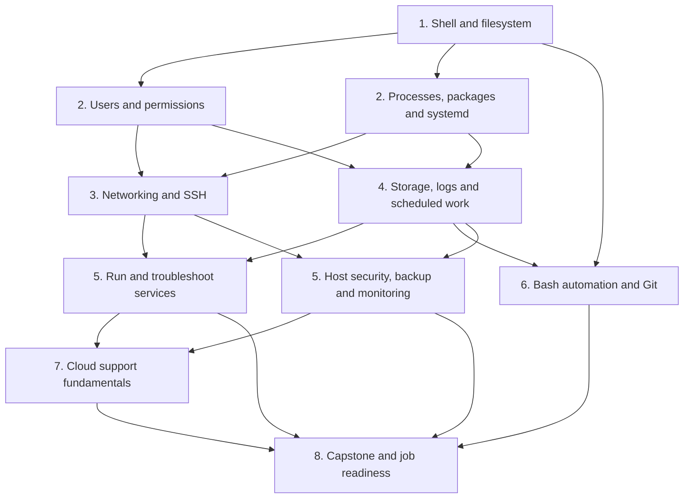
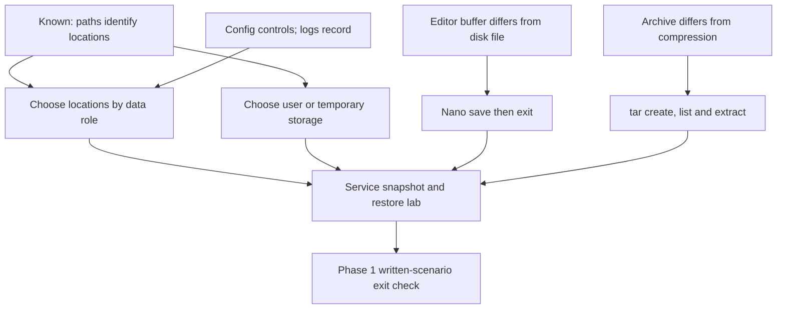

# ROADMAP

Updated: 2026-09-03
Target window: 14–16 weeks
Current phase: Phase 2 probe

Current checkpoint: the guided file-management work and the unprompted transfer
check are complete. From `/home/raf_0411`, without using `cd`, the learner
created a nested transfer directory, copied the backup under a new temporary
filename, renamed it, declined a collision with `cp -i`, and verified both
exact paths plus the unchanged working directory. The learner then used
`head -n`, `tail -n`, and `less` on `/etc/passwd`, including navigation and
forward search in `less`. The learner also demonstrated exact and
case-insensitive `grep`, line-numbered matches, and recursive `find` searches
using names, quoted wildcard patterns, and `-type f`. Pipelines were then used
to connect standard output to standard input, with order-dependent results.
The learner demonstrated `>`, `>>`, `2>`, and the meaning of `2>>` after a
slower, diagram-assisted treatment of normal versus error output. Path
construction and stream selection remain queued for spaced review.

On 2026-08-29, the learner used `type` to distinguish aliases, builtins, and
external programs and selected `help`, `--help`, or `man` appropriately. They
used `man grep` to repair `grep -n`, then correctly demonstrated its line-number
prefix and parsed a multi-file command. Separate stdout and stderr overwrite
redirection was repaired on an immediate transfer check. An append experiment
was interrupted by pressing Enter after `>>`, which created a second unintended
command and an extra captured diagnostic; diagnosis is complete, but the clean
append re-test remains unfinished.

On 2026-08-30, exact stream destinations and overwrite/append modes were
retrieved correctly for a complete command. The learner still expected an
incomplete `2>>` to affect a filename entered after pressing Enter. Bash's
parse-first behavior was demonstrated, but it has not yet been explained back
or re-tested by the learner.

On 2026-08-31, the learner repaired that model through concrete experiments:
an invalid trailing `2>>` prevented an earlier `>` from executing, and a later
redirection-only submission could not capture stderr from an already-finished
command. A clean overwrite/append check then produced the expected file state.
The learner identified ordinary pipeline stream routing and independently
constructed a correct `grep` stderr-redirection plus `head` stdout pipeline.
Long pasted commands were repeatedly split by real newlines, so command
boundaries remain queued for spaced review rather than blocking progression.

On 2026-09-01, the learner completed the filesystem-hierarchy, Nano, and archive
strands. They chose common directories from data purpose and lifetime,
demonstrated Nano's buffer-versus-disk behavior, separated archiving from gzip
compression, inspected a snapshot before extraction, and restored it to a
controlled destination. An initially incomplete snapshot became a successful
troubleshooting exercise: the learner inspected the source, added the missing
log, recreated the archive, and verified a point-in-time restore.

Phase 1 passed its exit gate on 2026-09-03. From `/home/raf_0411` without `cd`,
the learner completed the configuration/log/report hierarchy and file-selection
scenario. They then constructed, repaired, ran, verified, and explained a
`grep`/`head` pipeline that overwrote matching results while appending `grep`
diagnostics separately. A repeated run produced a stable two-line match report
and a diagnostic report that grew from one line to two. Pipeline routing and
the `~/` boundary needed focused repair, so both remain queued for spaced
review rather than blocking progression. Phase 2 now begins with a probe of
identity, ownership, permissions, `sudo`, and least privilege.

The dates are pacing estimates, not permission to advance. Each phase has an
exit check; demonstrated skill matters more than merely completing a week.

## Dependency path

## Phase 1 — Linux command line and filesystem (Week 1)

Status: passed on 2026-09-03. The directory-role, Nano, `tar` snapshot/restore,
written file-management scenario, and independent stream-routing pipeline are
complete. Revisit exact `~/` paths and stdout-to-stdin pipeline explanations
through later operational work.

Current lesson dependency map:

Learn:

- command structure, arguments, options, paths, and working-directory state;
- create, copy, move, rename, and remove files/directories safely;
- inspect text and search with `less`, `head`, `tail`, `grep`, and `find`;
- pipes, standard input/output/error, and `>`, `>>`, and `2>`;
- command discovery with `man`, `--help`, and shell history;
- basic filesystem hierarchy, archives, and editing with `nano`.

Exit check: complete a file-management and log-search lab from a written
scenario, without command-by-command instructions, and explain every command.

## Phase 2 — Core Ubuntu administration (Weeks 2–3)

Current work: probe the learner's boundary across identities, ownership,
permission bits, file-versus-directory semantics, `sudo`, and least privilege.
The opening `ls -l` permission-string scenario was assigned but not attempted
before the session ended. Resume it after a short retrieval check, then build
the dependency map and lesson plan from the completed probe before teaching.

Learn:

- users, groups, ownership, permission bits, `sudo`, and least privilege;
- processes, signals, jobs, resource inspection, and `/proc` basics;
- packages, repositories, updates, and safe change habits;
- services, units, boot targets, `systemd`, `systemctl`, and `journalctl`;
- memory, CPU, load, disk-space, and OS inspection.

Labs: create a restricted service account; repair broken access; install and
manage a service; diagnose a deliberately stopped or misconfigured unit.

Exit check: administer users and a service, locate relevant logs, and explain
the difference between a program, process, daemon, service, and service manager.

## Phase 3 — Networking and remote administration (Weeks 4–5)

Learn:

- IPv4, subnet basics, private/public addresses, loopback, gateways, routing;
- TCP versus UDP, ports, sockets, DNS, DHCP, and the web request path;
- inspect and test with `ip`, `ss`, `ping`, `traceroute`, `dig`, and `curl`;
- SSH passwords versus keys, host keys, configuration, copying files, and
  secure remote access;
- host firewall fundamentals with Ubuntu's supported tooling.

Labs: map the homelab network; set up key-based SSH; expose only an intended
service; diagnose DNS, route, port, firewall, and application failures.

Exit check: troubleshoot several unknown connectivity failures using a layered
method and justify each test.

## Phase 4 — Storage and routine operations (Weeks 6–7)

Learn:

- partitions, filesystems, mounts, capacity versus inode exhaustion;
- log locations, journal queries, rotation, and retention;
- archives, checksums, backup strategies, and verified restores;
- recurring work with cron and systemd timers;
- routine patching, inventory, operational notes, and change verification.

Labs: attach or simulate extra storage; recover from a full-filesystem
scenario; schedule and verify a backup; restore deleted test data.

Exit check: find a storage/logging problem, fix it safely, and restore data from
a backup rather than merely creating one.

## Phase 5 — Operate a real service securely (Weeks 8–9)

Learn:

- install and configure Nginx or Apache;
- configuration syntax testing, ports, logs, processes, and dependencies;
- HTTP and TLS fundamentals;
- permissions, firewall policy, updates, backup, and simple monitoring;
- a repeatable troubleshooting workflow and incident notes.

Project 1: publish and document a small homelab web service, then diagnose
injected failures such as a stopped unit, occupied port, invalid configuration,
permissions error, firewall rule, and low disk space.

Exit check: recover the service from unknown failures and provide concise
evidence of the root cause. Begin applying selectively to support and junior
infrastructure roles after this gate.

## Phase 6 — Useful automation (Week 10)

Learn:

- Bash variables, quoting, tests, loops, functions, exit status, and strict
  error handling;
- automate health checks, backups, account/inventory tasks, and log summaries;
- Git commits, branches, diffs, and README/runbook documentation;
- optional Ansible introduction only after the manual tasks are understood.

Project 2: create a small, tested administration toolkit in Git. Scripts must
be safe to rerun and must report failures clearly.

Exit check: automate a task already performed manually and explain its failure
modes.

## Phase 7 — Cloud support fundamentals (Weeks 11–12)

Choose one provider based on local job demand, then learn:

- regions/zones, virtual machines, images, disks, object storage, and snapshots;
- virtual networks, subnets, routes, security groups/firewalls, DNS, and public
  versus private access;
- identities, roles, policies, least privilege, secrets, and shared
  responsibility;
- metrics, logs, alerts, quotas, basic cost awareness, and provider support
  documentation.

Project 3: deploy the Phase 5 service to a small cloud VM, restrict access,
monitor it, back it up, and write a teardown procedure to prevent unwanted cost.

Exit check: diagnose access and service failures without randomly changing
rules, and explain cost/security implications.

## Phase 8 — Capstone and employment preparation (Weeks 13–16)

- Combine Linux, networking, service management, security, backup, monitoring,
  and automation into one reproducible project.
- Publish sanitized diagrams, runbooks, incident reports, and scripts.
- Practice Linux and networking troubleshooting interviews at the terminal.
- Translate lab evidence into resume bullets and apply consistently.
- Use job-posting feedback to adjust weak areas; study an entry certification
  only if it reinforces, rather than replaces, the practical work.

## Typical five-hour study day

- 30 minutes: retrieval practice from current and older material.
- 60 minutes: one new concept with primary documentation.
- 150 minutes: hands-on lab, including deliberate failures.
- 45 minutes: explain results and write a short runbook.
- 15 minutes: record errors and choose the next review item.

This cadence can be shortened when needed; consistency and successful labs are
more important than filling all five hours.
