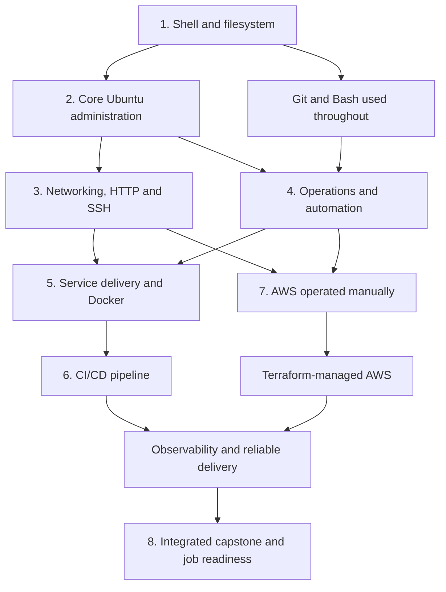
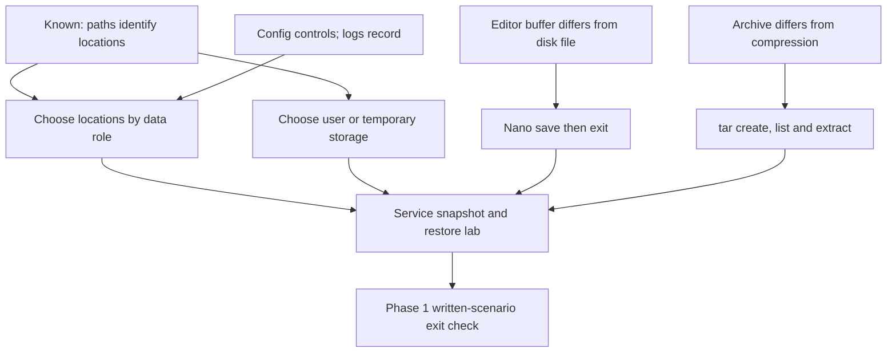
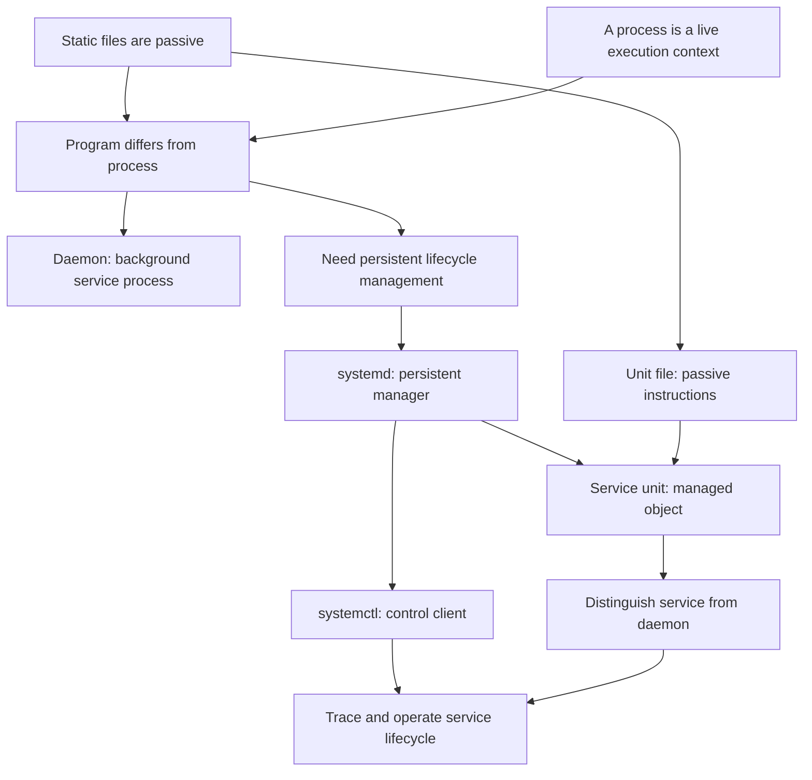
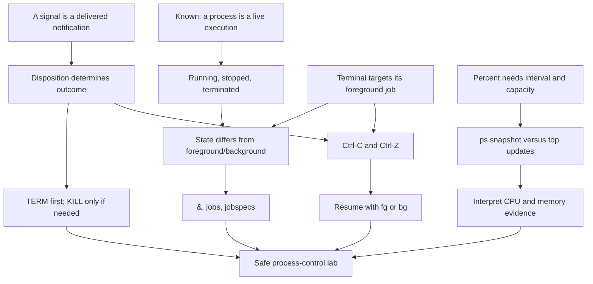
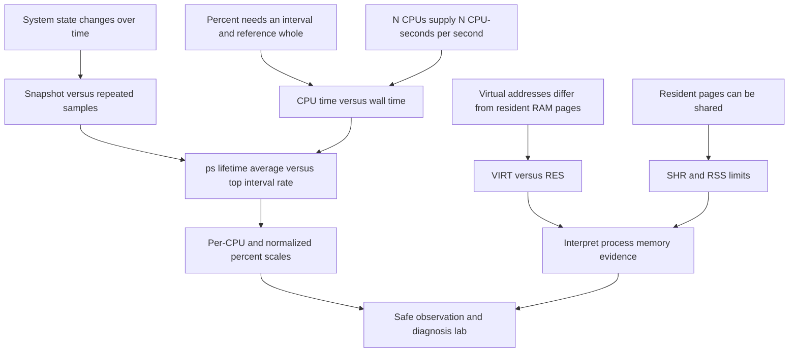
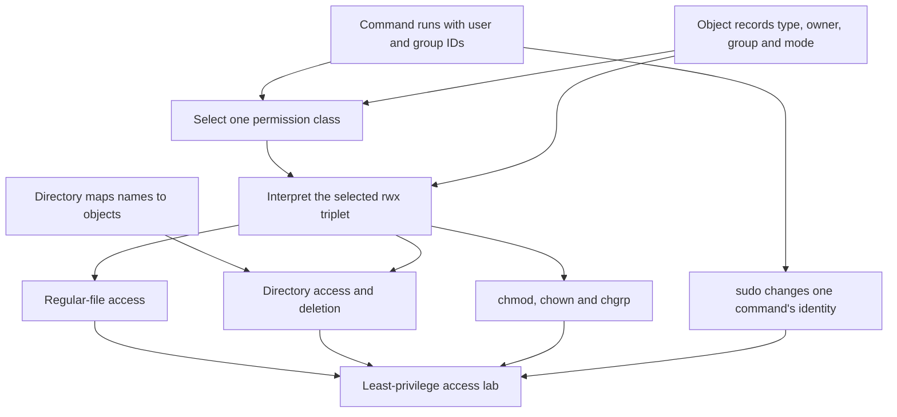
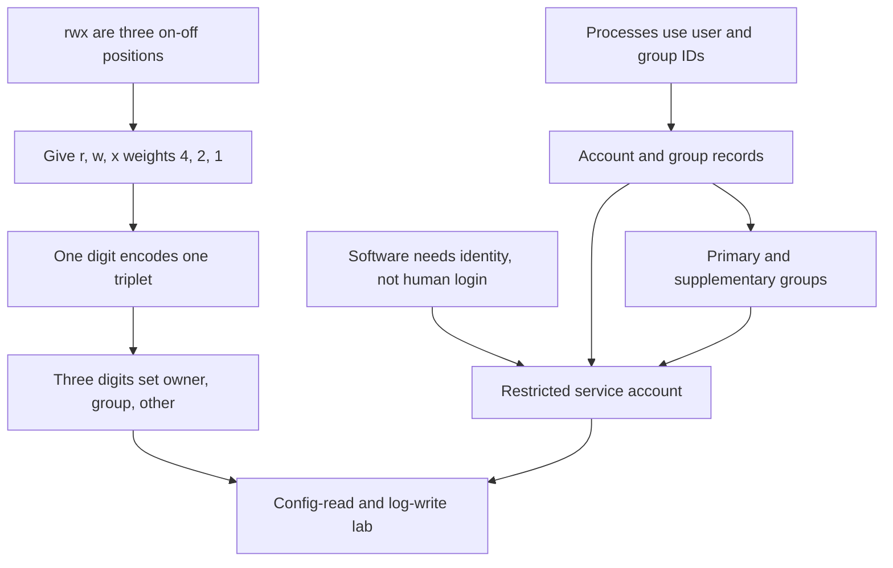

# ROADMAP

Updated: 2026-09-11
Target window: 14–16 weeks
Current phase: Phase 2 signals, jobs, and resource inspection lesson in progress

Primary career direction: entry-level DevOps, Junior Cloud Infrastructure,
InfraOps, and Cloud Operations/Support roles. Linux/SysAdmin roles remain
valuable secondary entry routes. AWS is the primary cloud; Docker, CI/CD,
Terraform, Git, scripting, and observability are required outcomes. Deep
Kubernetes and multi-cloud operation are outside the initial exit gate.

Current checkpoint: the guided file-management work and the unprompted transfer
check are complete. From `/home/raf_0411`, without using `cd`, the learner
created a nested transfer directory, copied the backup under a new temporary
filename, renamed it, declined a collision with `cp -i`, and verified both
exact paths plus the unchanged working directory. The learner then used
`head -n`, `tail -n`, and `less` on `/etc/passwd`, including navigation and
forward search in `less`. The learner also demonstrated exact and
case-insensitive `grep`, line-numbered matches, and recursive `find` searches
using names, quoted wildcard patterns, and `-type f`. Pipelines were then used
to connect standard output to standard input, with order-dependent results.
The learner demonstrated `>`, `>>`, `2>`, and the meaning of `2>>` after a
slower, diagram-assisted treatment of normal versus error output. Path
construction and stream selection remain queued for spaced review.

On 2026-08-29, the learner used `type` to distinguish aliases, builtins, and
external programs and selected `help`, `--help`, or `man` appropriately. They
used `man grep` to repair `grep -n`, then correctly demonstrated its line-number
prefix and parsed a multi-file command. Separate stdout and stderr overwrite
redirection was repaired on an immediate transfer check. An append experiment
was interrupted by pressing Enter after `>>`, which created a second unintended
command and an extra captured diagnostic; diagnosis is complete, but the clean
append re-test remains unfinished.

On 2026-08-30, exact stream destinations and overwrite/append modes were
retrieved correctly for a complete command. The learner still expected an
incomplete `2>>` to affect a filename entered after pressing Enter. Bash's
parse-first behavior was demonstrated, but it has not yet been explained back
or re-tested by the learner.

On 2026-08-31, the learner repaired that model through concrete experiments:
an invalid trailing `2>>` prevented an earlier `>` from executing, and a later
redirection-only submission could not capture stderr from an already-finished
command. A clean overwrite/append check then produced the expected file state.
The learner identified ordinary pipeline stream routing and independently
constructed a correct `grep` stderr-redirection plus `head` stdout pipeline.
Long pasted commands were repeatedly split by real newlines, so command
boundaries remain queued for spaced review rather than blocking progression.

On 2026-09-01, the learner completed the filesystem-hierarchy, Nano, and archive
strands. They chose common directories from data purpose and lifetime,
demonstrated Nano's buffer-versus-disk behavior, separated archiving from gzip
compression, inspected a snapshot before extraction, and restored it to a
controlled destination. An initially incomplete snapshot became a successful
troubleshooting exercise: the learner inspected the source, added the missing
log, recreated the archive, and verified a point-in-time restore.

Phase 1 passed its exit gate on 2026-09-03. From `/home/raf_0411` without `cd`,
the learner completed the configuration/log/report hierarchy and file-selection
scenario. They then constructed, repaired, ran, verified, and explained a
`grep`/`head` pipeline that overwrote matching results while appending `grep`
diagnostics separately. A repeated run produced a stable two-line match report
and a diagnostic report that grew from one line to two. Pipeline routing and
the `~/` boundary needed focused repair, so both remain queued for spaced
review rather than blocking progression. The opening Phase 2 probe is now
complete. The learner understands login identity, the broad purpose and risk of
`sudo`, and least privilege, but does not yet understand permission-triplet
selection, file-versus-directory `rwx`, or the distinct roles of `chmod`,
`chown`, and `chgrp`. The learner then completed the planned lesson and live
access lab: exclusive class selection, file-versus-directory `rwx`, symbolic
mode changes, ownership changes, command-scoped `sudo`, and least-privilege
repair were all demonstrated. The next probe found numeric/binary permission
encoding and account-management commands to be new, while the learner already
has the right least-privilege intuition for service identities. The plan was
approved and numeric modes were introduced as weighted `rwx` positions; the
first calculation check remains unanswered at session end.

On 2026-09-04, the learner derived one- and three-digit numeric modes, applied
`640`, separated account creation from privilege assignment, and distinguished
primary from supplementary groups. On Ubuntu 24.04.4 they collision-checked and
created a restricted `reportsvc` account, then built mode-`750` config/log
directories with a read-only-for-service `640` configuration and writable
existing `660` log. Live tests proved allowed configuration reads and log
writes plus denied configuration writes, log creation, and log deletion. A
disposable mode-`770` directory also proved that a read-only file can be deleted
through parent-directory `w+x`. A later retrieval correctly separated file
append from parent-directory deletion. After one correction, the learner also
distinguished visual wrapping from a real newline on a fresh example. Finally,
direct `id` execution as `reportsvc` succeeded, while login-style execution
produced a missing-home warning followed by `nologin` refusal. Retrieve those
two failure causes once, then begin the formal process/service probe.

On 2026-09-06, the learner correctly separated a stored program from a running
process and distinguished a `.service` unit file from the executable named by
`ExecStart`. A later retrieval correctly separated the account home field from
the login-shell field. The process/service probe is now complete: the learner
recognized that a daemon is some kind of process, but repeatedly assigned the
persistent management role to `systemctl`, then said `systemd` becomes the
server process, and finally swapped the program, daemon, service, unit-file,
and control-client categories in a concrete SSH example. Teach the persistent
manager relationship and daemon/service boundary from the established
file-versus-process foundation.

The dates are pacing estimates, not permission to advance. Each phase has an
exit check; demonstrated skill matters more than merely completing a week.

## Dependency path

## Phase 1 — Linux command line and filesystem (Week 1)

Status: passed on 2026-09-03. The directory-role, Nano, `tar` snapshot/restore,
written file-management scenario, and independent stream-routing pipeline are
complete. Revisit exact `~/` paths and stdout-to-stdin pipeline explanations
through later operational work.

Current lesson dependency map:

Learn:

- command structure, arguments, options, paths, and working-directory state;
- create, copy, move, rename, and remove files/directories safely;
- inspect text and search with `less`, `head`, `tail`, `grep`, and `find`;
- pipes, standard input/output/error, and `>`, `>>`, and `2>`;
- command discovery with `man`, `--help`, and shell history;
- basic filesystem hierarchy, archives, and editing with `nano`.

Exit check: complete a file-management and log-search lab from a written
scenario, without command-by-command instructions, and explain every command.

## Phase 2 — Core Ubuntu administration (Weeks 2–3)

Current work: numeric modes, the collision-checked restricted service-account
lab, parent-directory deletion retrieval, and the direct-command-versus-login-
shell comparison are complete. The formal program/process/service/`systemd`
probe is also complete. The learner's floor is the program/process distinction,
recognition that a unit file is configuration, and a rough association of a
daemon with a process. The ceiling is the relationship among a persistent
manager, its short-lived control client, a managed service unit, and its
processes. The lesson repaired that model conceptually and through live
inspection. The disposable transient-service lifecycle check is complete:
after its `sleep 1800` ended, read-only checks showed the unit as `not-found`
and inactive with `MainPID=0`, and its former PID was absent.

Planned process/service/`systemd` dependency map:

Teaching order: briefly re-anchor passive files and live processes; derive the
need for a manager that outlives an administrator's command; separate
`systemd` from `systemctl`; connect passive unit configuration to systemd's
managed service unit; distinguish a daemon process from the broader service
abstraction; then trace and inspect an actual unit through start, status, stop,
and relevant process state. Do not equate every service with a continuously
running daemon: include a later `Type=oneshot` counterexample after the basic
model is secure.

Status: the passive-file/process foundation, daemon definition, persistent
manager need, `systemd`/`systemctl` separation, unit-file/service-unit
distinction, and `Type=oneshot` counterexample were demonstrated. Live Ubuntu
inspection connected PID 1, `ssh.service`, its unit file, and its `sshd`
MainPID. A collision-checked transient `sleep` service was created and inspected
successfully. On 2026-09-07, the learner verified that its 30-minute process
was absent and the `--collect` unit had unloaded. After correction, they
correctly transferred the natural-exit-to-inactive-to-collection chain to a
fresh example. Continue to signals and jobs.

Planned signals, jobs, and process-inspection dependency map:

Probe result: the learner knows that `Ctrl+C` commonly returns the prompt,
`Ctrl+Z` pauses a process, `ps` is a short-lived view, and `top`/`htop` show
CPU and memory use. The current ceiling is signal delivery versus outcome,
plain `kill` versus forced termination, foreground/background versus
running/stopped, Bash job-control commands, and multicore CPU percentages.

Teaching order: derive terminal signal behavior from delivered notification
plus signal disposition; separate stopped/terminated state from foreground/
background placement; demonstrate `&`, `jobs -l`, `fg`, and `bg` using a
disposable `sleep`; derive the safe `SIGTERM`-then-`SIGKILL` escalation; then
compare `ps` snapshots with `top` intervals and interpret per-process CPU and
memory before controlling anything. Use prediction and live inspection at each
step, and explicitly contrast a shell-local job with a systemd-managed service
unit.

Status: the learner approved this plan on 2026-09-07. The first foundation was
initially unstable: repeated checks conflated delivery with termination or
stopping, and a returning handler was confused with stopped processes. In the
final same-day continuation, the learner answered a clean three-part retrieval
correctly, separating a returning handler, default termination,
cleanup-and-exit, ignored delivery, and an `active (exited)` service unit. The
signal-disposition foundation is now demonstrated conceptually. Process state
versus foreground/background placement and the disposable job-control lab were
completed on 2026-09-08 using macOS Zsh, whose observed behavior matched the
planned shell-job model. The learner used `Ctrl+Z`, `bg`, `fg`, trailing `&`,
`jobs -l`, `%+`, `%1`, and a PID with `ps`, then terminated and verified removal
of the disposable job. Foreground and background were repeatedly swapped before
a correct final transfer check, so retain that distinction in spaced review.
In a same-day continuation, the learner correctly retrieved that `fg` puts the
job in the foreground and makes the shell wait. They then established that
application cleanup requires further process instructions. Installed macOS
manual pages were used to introduce plain `kill PID` as `SIGTERM`, catchable
`SIGTERM`, and uncatchable/unignorable `SIGKILL`. On 2026-09-09, the learner
repaired handler-return behavior, signal-request acceptance versus proof of
exit, and the wait-before-fresh-inspection order. A live Ubuntu comparison then
showed ordinary `sleep` terminate under the default disposition while a Bash
process with a returning handler remained after the same signal and a wait.
The conceptual model is now demonstrated live. Command construction was still
at the edge after 2026-09-09. On 2026-09-10, the learner first repeated
`SIGTERM` instead of escalating and used an inconsistent variable name in a
written rehearsal. They then verified that old PID `375142` was absent, created
and identity-checked a fresh disposable Bash handler as PID `5767`, and
completed the full live flow: `SIGTERM`, wait, fresh `ps`, conditional
`SIGKILL`, wait, and final empty `ps`. The command-level safe-termination node
is complete. Proceed to `ps`/`top` and resource interpretation while retaining
this sequence for spaced review.

Focused process-resource probe on 2026-09-10: the learner correctly described
`ps` as a short-lived observation and `top` as a foreground program that keeps
refreshing. They also derived that one fully busy worker on a four-worker
machine consumes one quarter of total capacity, but could not yet interpret a
process row near `100%` CPU. They correctly expected only needed file data to
be resident in RAM, but `VIRT`, `RES`/RSS, and shared resident pages are new.

Focused process-resource dependency map:

Teaching order: confirm the time, percentage, and CPU-capacity foundations;
derive the different measurement windows used by `ps` and `top`; connect one
busy CPU to the installed `top` normalization mode; then build `VIRT`, `RES`,
and `SHR` from virtual mappings and resident pages. Verify the VM's installed
procps-ng version and manual pages before the lab. Finish with controlled CPU
and memory observations, emphasizing evidence over conclusions from one frame.
The learner approved this plan on 2026-09-10. The first node established that
`top` displays discrete refresh frames rather than observing continuously. In
a continuation, the learner correctly identified that no refresh occurred
while a short-lived example process existed, so it could be absent from both
frames. They then overgeneralized that a first refresh always precedes a
process's start; confirm that existing processes can appear in the first frame.
Ubuntu output verified procps-ng 4.0.4 for both tools. The installed `ps(1)`
manual established its CPU-time-over-elapsed-lifetime percentage, and the
learner independently calculated a fresh `15/60 = 25%` example after
corrections to unit cancellation and percentage conversion. Next establish
`top`'s since-last-update interval from its installed manual, then contrast the
two windows.

Completed first users-and-permissions lesson dependency map:

Teaching order: inspect identity and metadata; decode one `ls -l` entry; derive
exclusive owner/group/other selection; compare regular-file and directory
`rwx`; derive deletion from the parent directory; change access symbolically;
then repair a deliberately broken access scenario using least privilege.

Status: completed on 2026-09-03. Exclusive class selection and least privilege
required focused repair, then transferred successfully to live file-access and
deletion experiments.

Next numeric-modes and service-account dependency map:

Planned teaching order: derive numeric notation from familiar permission
triplets without assuming binary knowledge; distinguish account identity from
home, password, shell, and privilege; compare Ubuntu's `adduser` with
`useradd`; create a no-login mock service account and dedicated access group;
then verify permitted and denied configuration/log operations. Inspect all
names and paths for collisions before creating anything, and keep cleanup
explicit and narrowly scoped.

Status: completed on 2026-09-04, including the final `sudo -u` versus
login-style `sudo -iu` execution check. Numeric notation, account creation,
group concepts, no-login service identity, collision checks, configuration/log
access, and distinct direct/login behavior were demonstrated live. Keep the
home-versus-shell explanation and command-boundary handling in spaced review.

Learn:

- users, groups, ownership, permission bits, `sudo`, and least privilege;
- processes, signals, jobs, resource inspection, and `/proc` basics;
- packages, repositories, updates, and safe change habits;
- services, units, boot targets, `systemd`, `systemctl`, and `journalctl`;
- memory, CPU, load, disk-space, and OS inspection.

Labs: create a restricted service account; repair broken access; install and
manage a service; diagnose a deliberately stopped or misconfigured unit.

Exit check: administer users and a service, locate relevant logs, and explain
the difference between a program, process, daemon, service, and service manager.

## Phase 3 — Networking, HTTP, and remote administration (Weeks 4–5)

Learn:

- IPv4, subnet basics, private/public addresses, loopback, gateways, and routes;
- TCP versus UDP, ports, listening sockets, DNS, and DHCP;
- the HTTP/HTTPS request path, status codes, headers, TLS, and reverse proxies;
- inspect and test with `ip`, `ss`, `ping`, `traceroute`, `dig`, and `curl`;
- SSH keys, host keys, client/server configuration, copying files, and secure
  remote access;
- host-firewall fundamentals with Ubuntu's supported tooling.

Labs: map the homelab network; set up key-based SSH; trace a request from DNS
through a listening service; expose only an intended port; diagnose DNS, route,
socket, firewall, TLS, and application failures.

Exit check: recover from several unknown connectivity failures using a layered
method and justify what each test proves or rules out.

## Phase 4 — Operational automation and delivery foundations (Weeks 5–7)

Git and Bash begin as soon as Phase 2 is complete and remain part of every later
project rather than being isolated at the end of the roadmap.

Learn:

- Git repositories, commits, branches, diffs, merge basics, `.gitignore`, and
  clear README/runbook documentation;
- Bash variables, quoting, exit status, tests, loops, functions, pipelines, and
  safe failure handling;
- basic Python only where it is more appropriate than Bash for a small task;
- the delivery lifecycle: source, build, test, artifact, environment,
  deployment, observation, rollback, and incident feedback;
- package management, patch verification, inventory, and repeatable changes;
- filesystems, mounts, capacity versus inode exhaustion, journals, log rotation,
  checksums, backup/restore, cron, and systemd timers.

Labs: place operational work in Git; write safe health-check and backup scripts;
schedule one job; inject a disk or logging failure; restore deleted test data;
review the resulting diff and operational evidence.

Project 1: create a small administration toolkit with documentation and scripts
that are safe to rerun, preserve useful diagnostics, and report failures clearly.

Exit check: independently diagnose a storage/logging problem, restore data from
a verified backup, and automate one previously manual operation while explaining
the script's failure modes.

## Phase 5 — Service delivery and Docker (Weeks 7–9)

Learn:

- install, configure, secure, and troubleshoot Nginx plus a small application;
- configuration validation, environment variables, ports, logs, processes,
  dependencies, health checks, and graceful restart/rollback;
- Docker images versus containers, Dockerfiles, layers, build context, tags,
  container configuration, networking, bind mounts, volumes, and registries;
- Docker Compose for a small multi-container development or test environment;
- image and dependency hygiene, non-root execution, and secret boundaries.

Project 2: first publish the service conventionally on the Ubuntu homelab, then
containerize it and run the containerized form from a documented Git repository.
Diagnose injected failures such as a stopped unit/container, occupied port,
invalid configuration, permissions error, missing environment value, firewall
rule, and low disk space.

Exit check: deploy and recover both the host-managed and containerized service
from unfamiliar failures, explaining which evidence identifies the failing
layer. Begin selective applications for relevant support, infrastructure, and
trainee roles after this gate.

## Phase 6 — CI/CD and controlled releases (Weeks 9–10)

Use GitHub Actions as the primary learning system while keeping the concepts
transferable to GitLab CI, Jenkins, and other pipeline tools.

Learn:

- pipeline triggers, jobs, steps, runners, environments, artifacts, caches, and
  exit-status-driven failure;
- build and test the service, build/tag its Docker image, and publish it to a
  container registry;
- credentials, repository/environment secrets, least privilege, and safe log
  handling;
- controlled deployment, health verification, failed-release diagnosis, and
  rollback to a known-good artifact.

Project 3: create a pipeline that validates the repository, builds the image,
publishes an immutable tag, and deploys to a disposable or homelab target with
an explicit verification and rollback step.

Exit check: diagnose at least two deliberately broken pipeline stages from logs,
repair them without bypassing the failed checks, and restore a previous release.

## Phase 7 — AWS, Terraform, and observability (Weeks 10–13)

Operate AWS resources manually first so Terraform represents understood
infrastructure rather than hiding unfamiliar cloud behavior.

Learn:

- AWS accounts, regions, availability zones, CLI profiles, budgets, and cost
  teardown discipline;
- IAM users/roles/policies, temporary credentials, least privilege, secrets, and
  shared responsibility;
- EC2, AMIs, EBS, S3, VPCs, public/private subnets, route tables, internet
  gateways, security groups, DNS, and load-balancing fundamentals;
- CloudWatch metrics, logs, alarms, dashboards, and basic CloudTrail evidence;
- Terraform providers, resources, data sources, variables, outputs, state,
  dependency behavior, formatting, validation, plan, apply, import awareness,
  and destroy;
- basic reusable Terraform structure without premature module complexity;
- high-level mappings to equivalent GCP concepts, without attempting to operate
  two clouds deeply.

Project 4: manually deploy and observe the Phase 5 service on AWS, record the
architecture and decisions, tear it down, then reproduce the understood
environment with Terraform and connect it to the Phase 6 delivery pipeline.

Exit check: recreate the environment from the repository, deploy the service,
verify access controls and monitoring, diagnose injected IAM/network/service
failures, recover safely, and destroy resources without leaving unintended cost.

## Phase 8 — Integrated reliability capstone and employment (Weeks 13–16)

- Combine Linux, networking, service management, Docker, Git, CI/CD, AWS,
  Terraform, security, backup, monitoring, and automation into one coherent
  delivery-and-operations project.
- Add meaningful service health indicators, logs, metrics, alerts, backup and
  restore tests, rollback, and a small capacity or availability investigation.
- Run unfamiliar incident scenarios and produce concise timelines, evidence,
  root-cause statements, recovery verification, and prevention actions.
- Publish sanitized architecture diagrams, Terraform, pipeline configuration,
  scripts, README material, runbooks, and incident reports.
- Practice Linux, networking, cloud, Terraform, Docker, and CI/CD troubleshooting
  interviews through terminal-based scenarios.
- Translate demonstrated outcomes into resume bullets and apply consistently to
  DevOps, Junior Cloud Infrastructure, InfraOps, Cloud Operations/Support, and
  appropriate adjacent Linux/infrastructure roles.
- Use job-posting feedback to adjust weak areas. Treat certifications only as
  reinforcement, not substitutes for practical evidence.
- After the core exit gate, add Kubernetes concepts and one small deployment lab
  only if time and demonstrated foundations allow; deep Kubernetes is not an
  entry-level completion requirement.

Capstone exit check: from the repository and runbooks, reproduce the system,
deliver a change through CI/CD, observe it, recover from unknown injected
failures, restore protected data, explain security/cost tradeoffs, and tear down
cloud resources safely.

## Typical five-hour study day

- 30 minutes: retrieval practice from current and older material.
- 60 minutes: one new concept with primary documentation.
- 150 minutes: hands-on lab, including deliberate failures.
- 45 minutes: explain results and write a short runbook.
- 15 minutes: record errors and choose the next review item.

This cadence can be shortened when needed; consistency and successful labs are
more important than filling all five hours.
