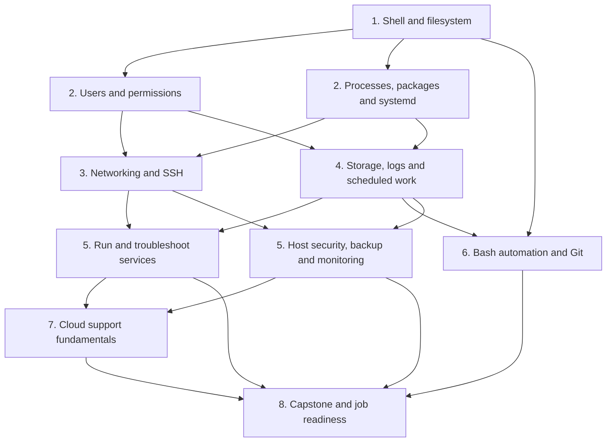
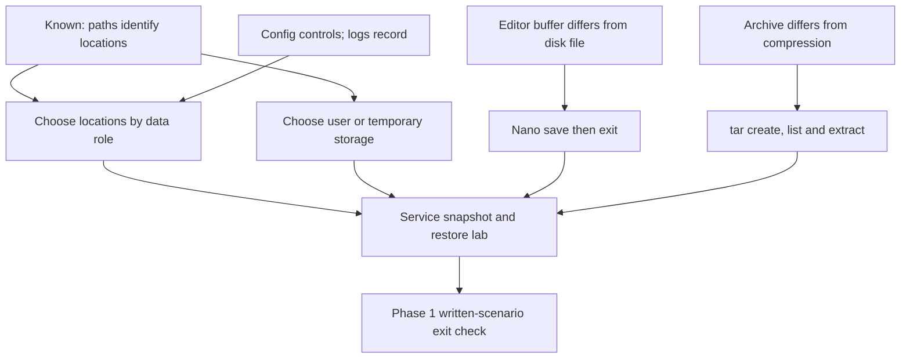
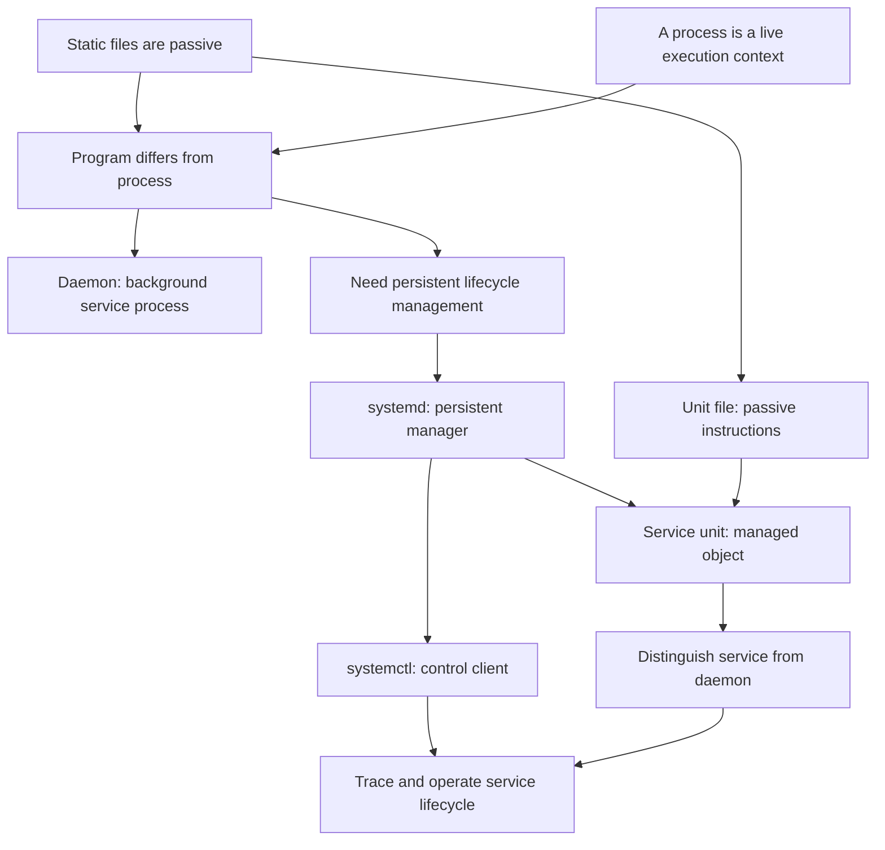
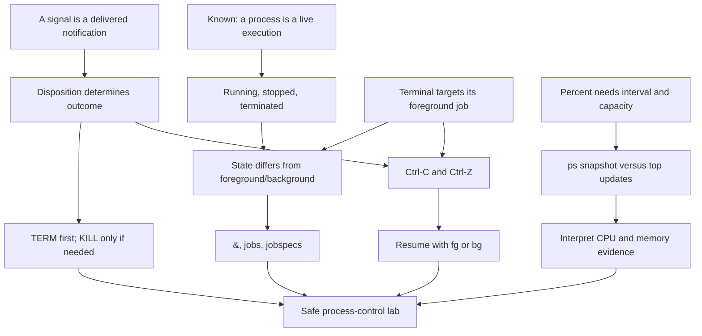
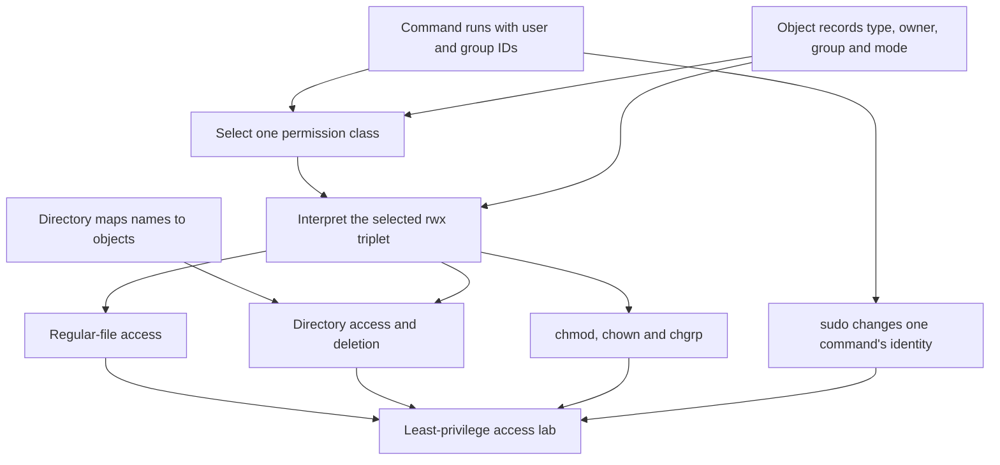
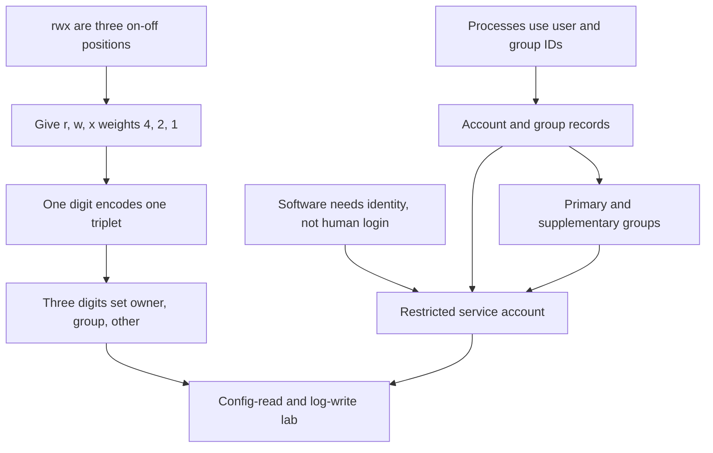

# ROADMAP

Updated: 2026-09-07
Target window: 14–16 weeks
Current phase: Phase 2 signals, jobs, and resource inspection lesson in progress

Current checkpoint: the guided file-management work and the unprompted transfer
check are complete. From `/home/raf_0411`, without using `cd`, the learner
created a nested transfer directory, copied the backup under a new temporary
filename, renamed it, declined a collision with `cp -i`, and verified both
exact paths plus the unchanged working directory. The learner then used
`head -n`, `tail -n`, and `less` on `/etc/passwd`, including navigation and
forward search in `less`. The learner also demonstrated exact and
case-insensitive `grep`, line-numbered matches, and recursive `find` searches
using names, quoted wildcard patterns, and `-type f`. Pipelines were then used
to connect standard output to standard input, with order-dependent results.
The learner demonstrated `>`, `>>`, `2>`, and the meaning of `2>>` after a
slower, diagram-assisted treatment of normal versus error output. Path
construction and stream selection remain queued for spaced review.

On 2026-08-29, the learner used `type` to distinguish aliases, builtins, and
external programs and selected `help`, `--help`, or `man` appropriately. They
used `man grep` to repair `grep -n`, then correctly demonstrated its line-number
prefix and parsed a multi-file command. Separate stdout and stderr overwrite
redirection was repaired on an immediate transfer check. An append experiment
was interrupted by pressing Enter after `>>`, which created a second unintended
command and an extra captured diagnostic; diagnosis is complete, but the clean
append re-test remains unfinished.

On 2026-08-30, exact stream destinations and overwrite/append modes were
retrieved correctly for a complete command. The learner still expected an
incomplete `2>>` to affect a filename entered after pressing Enter. Bash's
parse-first behavior was demonstrated, but it has not yet been explained back
or re-tested by the learner.

On 2026-08-31, the learner repaired that model through concrete experiments:
an invalid trailing `2>>` prevented an earlier `>` from executing, and a later
redirection-only submission could not capture stderr from an already-finished
command. A clean overwrite/append check then produced the expected file state.
The learner identified ordinary pipeline stream routing and independently
constructed a correct `grep` stderr-redirection plus `head` stdout pipeline.
Long pasted commands were repeatedly split by real newlines, so command
boundaries remain queued for spaced review rather than blocking progression.

On 2026-09-01, the learner completed the filesystem-hierarchy, Nano, and archive
strands. They chose common directories from data purpose and lifetime,
demonstrated Nano's buffer-versus-disk behavior, separated archiving from gzip
compression, inspected a snapshot before extraction, and restored it to a
controlled destination. An initially incomplete snapshot became a successful
troubleshooting exercise: the learner inspected the source, added the missing
log, recreated the archive, and verified a point-in-time restore.

Phase 1 passed its exit gate on 2026-09-03. From `/home/raf_0411` without `cd`,
the learner completed the configuration/log/report hierarchy and file-selection
scenario. They then constructed, repaired, ran, verified, and explained a
`grep`/`head` pipeline that overwrote matching results while appending `grep`
diagnostics separately. A repeated run produced a stable two-line match report
and a diagnostic report that grew from one line to two. Pipeline routing and
the `~/` boundary needed focused repair, so both remain queued for spaced
review rather than blocking progression. The opening Phase 2 probe is now
complete. The learner understands login identity, the broad purpose and risk of
`sudo`, and least privilege, but does not yet understand permission-triplet
selection, file-versus-directory `rwx`, or the distinct roles of `chmod`,
`chown`, and `chgrp`. The learner then completed the planned lesson and live
access lab: exclusive class selection, file-versus-directory `rwx`, symbolic
mode changes, ownership changes, command-scoped `sudo`, and least-privilege
repair were all demonstrated. The next probe found numeric/binary permission
encoding and account-management commands to be new, while the learner already
has the right least-privilege intuition for service identities. The plan was
approved and numeric modes were introduced as weighted `rwx` positions; the
first calculation check remains unanswered at session end.

On 2026-09-04, the learner derived one- and three-digit numeric modes, applied
`640`, separated account creation from privilege assignment, and distinguished
primary from supplementary groups. On Ubuntu 24.04.4 they collision-checked and
created a restricted `reportsvc` account, then built mode-`750` config/log
directories with a read-only-for-service `640` configuration and writable
existing `660` log. Live tests proved allowed configuration reads and log
writes plus denied configuration writes, log creation, and log deletion. A
disposable mode-`770` directory also proved that a read-only file can be deleted
through parent-directory `w+x`. A later retrieval correctly separated file
append from parent-directory deletion. After one correction, the learner also
distinguished visual wrapping from a real newline on a fresh example. Finally,
direct `id` execution as `reportsvc` succeeded, while login-style execution
produced a missing-home warning followed by `nologin` refusal. Retrieve those
two failure causes once, then begin the formal process/service probe.

On 2026-09-06, the learner correctly separated a stored program from a running
process and distinguished a `.service` unit file from the executable named by
`ExecStart`. A later retrieval correctly separated the account home field from
the login-shell field. The process/service probe is now complete: the learner
recognized that a daemon is some kind of process, but repeatedly assigned the
persistent management role to `systemctl`, then said `systemd` becomes the
server process, and finally swapped the program, daemon, service, unit-file,
and control-client categories in a concrete SSH example. Teach the persistent
manager relationship and daemon/service boundary from the established
file-versus-process foundation.

The dates are pacing estimates, not permission to advance. Each phase has an
exit check; demonstrated skill matters more than merely completing a week.

## Dependency path

## Phase 1 — Linux command line and filesystem (Week 1)

Status: passed on 2026-09-03. The directory-role, Nano, `tar` snapshot/restore,
written file-management scenario, and independent stream-routing pipeline are
complete. Revisit exact `~/` paths and stdout-to-stdin pipeline explanations
through later operational work.

Current lesson dependency map:

Learn:

- command structure, arguments, options, paths, and working-directory state;
- create, copy, move, rename, and remove files/directories safely;
- inspect text and search with `less`, `head`, `tail`, `grep`, and `find`;
- pipes, standard input/output/error, and `>`, `>>`, and `2>`;
- command discovery with `man`, `--help`, and shell history;
- basic filesystem hierarchy, archives, and editing with `nano`.

Exit check: complete a file-management and log-search lab from a written
scenario, without command-by-command instructions, and explain every command.

## Phase 2 — Core Ubuntu administration (Weeks 2–3)

Current work: numeric modes, the collision-checked restricted service-account
lab, parent-directory deletion retrieval, and the direct-command-versus-login-
shell comparison are complete. The formal program/process/service/`systemd`
probe is also complete. The learner's floor is the program/process distinction,
recognition that a unit file is configuration, and a rough association of a
daemon with a process. The ceiling is the relationship among a persistent
manager, its short-lived control client, a managed service unit, and its
processes. The lesson repaired that model conceptually and through live
inspection. The disposable transient-service lifecycle check is complete:
after its `sleep 1800` ended, read-only checks showed the unit as `not-found`
and inactive with `MainPID=0`, and its former PID was absent.

Planned process/service/`systemd` dependency map:

Teaching order: briefly re-anchor passive files and live processes; derive the
need for a manager that outlives an administrator's command; separate
`systemd` from `systemctl`; connect passive unit configuration to systemd's
managed service unit; distinguish a daemon process from the broader service
abstraction; then trace and inspect an actual unit through start, status, stop,
and relevant process state. Do not equate every service with a continuously
running daemon: include a later `Type=oneshot` counterexample after the basic
model is secure.

Status: the passive-file/process foundation, daemon definition, persistent
manager need, `systemd`/`systemctl` separation, unit-file/service-unit
distinction, and `Type=oneshot` counterexample were demonstrated. Live Ubuntu
inspection connected PID 1, `ssh.service`, its unit file, and its `sshd`
MainPID. A collision-checked transient `sleep` service was created and inspected
successfully. On 2026-09-07, the learner verified that its 30-minute process
was absent and the `--collect` unit had unloaded. After correction, they
correctly transferred the natural-exit-to-inactive-to-collection chain to a
fresh example. Continue to signals and jobs.

Planned signals, jobs, and process-inspection dependency map:

Probe result: the learner knows that `Ctrl+C` commonly returns the prompt,
`Ctrl+Z` pauses a process, `ps` is a short-lived view, and `top`/`htop` show
CPU and memory use. The current ceiling is signal delivery versus outcome,
plain `kill` versus forced termination, foreground/background versus
running/stopped, Bash job-control commands, and multicore CPU percentages.

Teaching order: derive terminal signal behavior from delivered notification
plus signal disposition; separate stopped/terminated state from foreground/
background placement; demonstrate `&`, `jobs -l`, `fg`, and `bg` using a
disposable `sleep`; derive the safe `SIGTERM`-then-`SIGKILL` escalation; then
compare `ps` snapshots with `top` intervals and interpret per-process CPU and
memory before controlling anything. Use prediction and live inspection at each
step, and explicitly contrast a shell-local job with a systemd-managed service
unit.

Status: the learner approved this plan on 2026-09-07. The first foundation was
introduced, but the learner still chose immediate kernel destruction in a
scenario that explicitly supplied a registered cleanup handler. Resume with
the pending default-action/handler/ignore comparison and do not build on this
node until signal delivery and outcome are reliably separated.

Completed first users-and-permissions lesson dependency map:

Teaching order: inspect identity and metadata; decode one `ls -l` entry; derive
exclusive owner/group/other selection; compare regular-file and directory
`rwx`; derive deletion from the parent directory; change access symbolically;
then repair a deliberately broken access scenario using least privilege.

Status: completed on 2026-09-03. Exclusive class selection and least privilege
required focused repair, then transferred successfully to live file-access and
deletion experiments.

Next numeric-modes and service-account dependency map:

Planned teaching order: derive numeric notation from familiar permission
triplets without assuming binary knowledge; distinguish account identity from
home, password, shell, and privilege; compare Ubuntu's `adduser` with
`useradd`; create a no-login mock service account and dedicated access group;
then verify permitted and denied configuration/log operations. Inspect all
names and paths for collisions before creating anything, and keep cleanup
explicit and narrowly scoped.

Status: completed on 2026-09-04, including the final `sudo -u` versus
login-style `sudo -iu` execution check. Numeric notation, account creation,
group concepts, no-login service identity, collision checks, configuration/log
access, and distinct direct/login behavior were demonstrated live. Keep the
home-versus-shell explanation and command-boundary handling in spaced review.

Learn:

- users, groups, ownership, permission bits, `sudo`, and least privilege;
- processes, signals, jobs, resource inspection, and `/proc` basics;
- packages, repositories, updates, and safe change habits;
- services, units, boot targets, `systemd`, `systemctl`, and `journalctl`;
- memory, CPU, load, disk-space, and OS inspection.

Labs: create a restricted service account; repair broken access; install and
manage a service; diagnose a deliberately stopped or misconfigured unit.

Exit check: administer users and a service, locate relevant logs, and explain
the difference between a program, process, daemon, service, and service manager.

## Phase 3 — Networking and remote administration (Weeks 4–5)

Learn:

- IPv4, subnet basics, private/public addresses, loopback, gateways, routing;
- TCP versus UDP, ports, sockets, DNS, DHCP, and the web request path;
- inspect and test with `ip`, `ss`, `ping`, `traceroute`, `dig`, and `curl`;
- SSH passwords versus keys, host keys, configuration, copying files, and
  secure remote access;
- host firewall fundamentals with Ubuntu's supported tooling.

Labs: map the homelab network; set up key-based SSH; expose only an intended
service; diagnose DNS, route, port, firewall, and application failures.

Exit check: troubleshoot several unknown connectivity failures using a layered
method and justify each test.

## Phase 4 — Storage and routine operations (Weeks 6–7)

Learn:

- partitions, filesystems, mounts, capacity versus inode exhaustion;
- log locations, journal queries, rotation, and retention;
- archives, checksums, backup strategies, and verified restores;
- recurring work with cron and systemd timers;
- routine patching, inventory, operational notes, and change verification.

Labs: attach or simulate extra storage; recover from a full-filesystem
scenario; schedule and verify a backup; restore deleted test data.

Exit check: find a storage/logging problem, fix it safely, and restore data from
a backup rather than merely creating one.

## Phase 5 — Operate a real service securely (Weeks 8–9)

Learn:

- install and configure Nginx or Apache;
- configuration syntax testing, ports, logs, processes, and dependencies;
- HTTP and TLS fundamentals;
- permissions, firewall policy, updates, backup, and simple monitoring;
- a repeatable troubleshooting workflow and incident notes.

Project 1: publish and document a small homelab web service, then diagnose
injected failures such as a stopped unit, occupied port, invalid configuration,
permissions error, firewall rule, and low disk space.

Exit check: recover the service from unknown failures and provide concise
evidence of the root cause. Begin applying selectively to support and junior
infrastructure roles after this gate.

## Phase 6 — Useful automation (Week 10)

Learn:

- Bash variables, quoting, tests, loops, functions, exit status, and strict
  error handling;
- automate health checks, backups, account/inventory tasks, and log summaries;
- Git commits, branches, diffs, and README/runbook documentation;
- optional Ansible introduction only after the manual tasks are understood.

Project 2: create a small, tested administration toolkit in Git. Scripts must
be safe to rerun and must report failures clearly.

Exit check: automate a task already performed manually and explain its failure
modes.

## Phase 7 — Cloud support fundamentals (Weeks 11–12)

Choose one provider based on local job demand, then learn:

- regions/zones, virtual machines, images, disks, object storage, and snapshots;
- virtual networks, subnets, routes, security groups/firewalls, DNS, and public
  versus private access;
- identities, roles, policies, least privilege, secrets, and shared
  responsibility;
- metrics, logs, alerts, quotas, basic cost awareness, and provider support
  documentation.

Project 3: deploy the Phase 5 service to a small cloud VM, restrict access,
monitor it, back it up, and write a teardown procedure to prevent unwanted cost.

Exit check: diagnose access and service failures without randomly changing
rules, and explain cost/security implications.

## Phase 8 — Capstone and employment preparation (Weeks 13–16)

- Combine Linux, networking, service management, security, backup, monitoring,
  and automation into one reproducible project.
- Publish sanitized diagrams, runbooks, incident reports, and scripts.
- Practice Linux and networking troubleshooting interviews at the terminal.
- Translate lab evidence into resume bullets and apply consistently.
- Use job-posting feedback to adjust weak areas; study an entry certification
  only if it reinforces, rather than replaces, the practical work.

## Typical five-hour study day

- 30 minutes: retrieval practice from current and older material.
- 60 minutes: one new concept with primary documentation.
- 150 minutes: hands-on lab, including deliberate failures.
- 45 minutes: explain results and write a short runbook.
- 15 minutes: record errors and choose the next review item.

This cadence can be shortened when needed; consistency and successful labs are
more important than filling all five hours.
