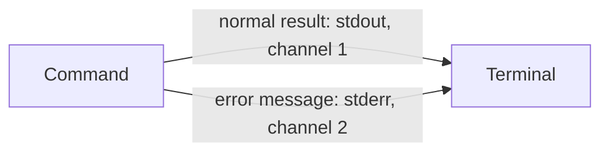
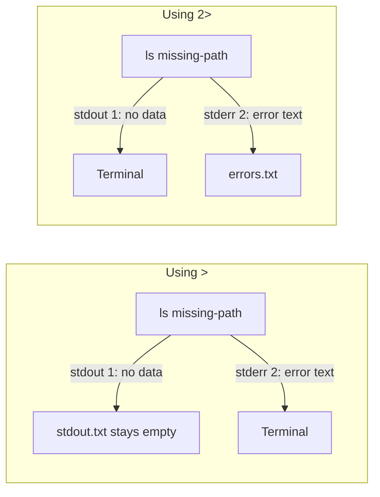

# Standard output and standard error

A command has two separate output channels. Both normally lead to the terminal:

Redirection changes the destination of only the named channel:

- `>` means redirect channel 1, standard output.
- `2>` means redirect channel 2, standard error.
- A failed `ls` has no successful listing to send on channel 1; it sends an
  error message on channel 2.
