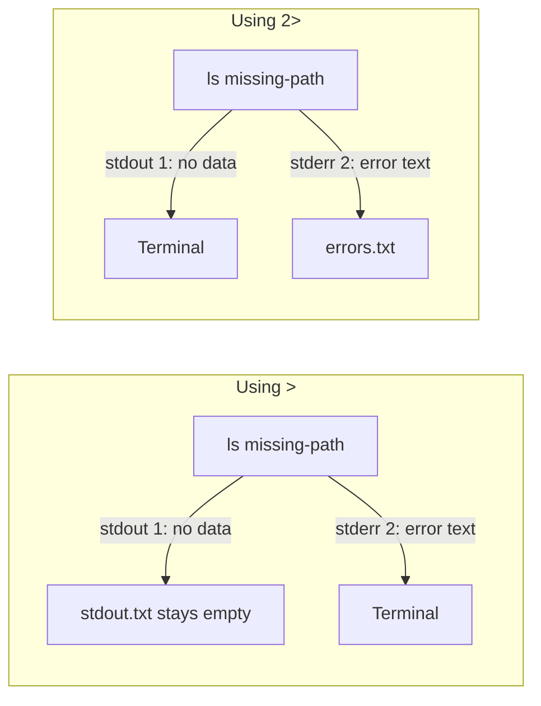
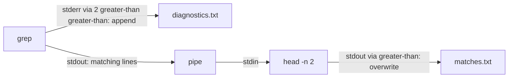

# Standard output and standard error

A command has two separate output channels. Both normally lead to the terminal:

Redirection changes the destination of only the named channel:

- `>` means redirect channel 1, standard output.
- `2>` means redirect channel 2, standard error.
- A failed `ls` has no successful listing to send on channel 1; it sends an
  error message on channel 2.

## Pipeline with separate error routing

In this pipeline, `grep` can produce both successful matches and diagnostics.
The normal pipe carries only `grep`'s standard output:

- A matching line travels as `grep` stdout, crosses the pipe as `head` stdin,
  and leaves `head` as stdout. `>` writes that final stdout to `matches.txt`.
- A missing-file diagnostic travels as `grep` stderr. `2>>` sends it directly
  to `diagnostics.txt`, so it never enters the pipe or reaches `head`.
