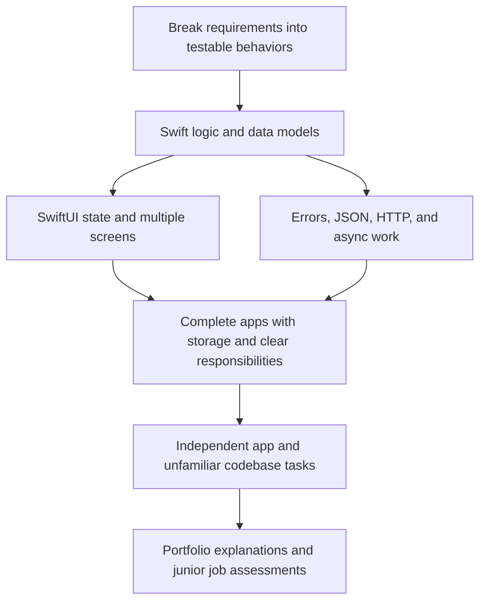

# ROADMAP

## Target and current position

Baseline: 16 weeks at 25 hours/week, approximately 400 planned hours. Assess
application readiness from week 12 (approximately 300 hours). These are planning
estimates, not automatic mastery or hiring deadlines. See GOAL.md for constraints.

Current position: initial assessment complete; begin Phase 1 with requirements
decomposition and a small executed Swift task. No curriculum milestone is complete.
Use STATE.md for demonstrated abilities; probe unassessed prerequisites as needed.

## Dependencies

Git, documentation, debugging, testing, and spaced retrieval accompany every
phase. A dependency is cleared by useful performance evidence, not elapsed weeks.

## Phases and practical milestones

| Approximate weeks | Work and prerequisites | Milestone evidence |
| --- | --- | --- |
| 1–2 (50 h) | Turn small requirements into inputs, changes, outputs, and checks. Consolidate types, conditions, functions, arrays/dictionaries/sets; introduce optionals, safe conversion, structs, enums, value semantics, and basic closures as tasks require. Run Swift in Xcode, inspect values with the debugger, make and inspect Git commits. | Implement a small in-memory shopping-list model from a short brief; handle blank/empty inputs and a new change request; explain and debug the code. |
| 3–5 (75 h) | Guided practice app: SwiftUI layouts, lists, text fields, forms, reusable views, identity, navigation, state ownership, bindings, and shared observable models. Probe classes/reference semantics before shared models; add practical protocols/extensions as needed. Introduce local storage, simple tests, and accessibility through features. | Working multi-screen shopping-list practice app. Explain who owns each piece of state, edit it across screens, verify relaunch behavior, and implement an unscaffolded change. This is a learning app, not automatically a portfolio project. |
| 6–9 (100 h) | Partially guided portfolio app 1: an API-backed app with a specific user purpose. Learn request/response and HTTP status basics, REST, JSON, Codable, error handling, URLSession, async/await, main-actor UI updates, and basic cancellation. Add local favorites/notes, explicit loading/error/empty states, and simple separation of concerns/MVVM when useful. Practice protocol-based test doubles, relevant generics, and reference ownership/capture issues. | A usable networked app with predictable failure/retry behavior, persistence, tests for meaningful logic and failures, a readable Git history, and a learner-led technical explanation. Learner proposes task breakdowns and implementation decisions. |
| 10–13 (100 h) | Independent portfolio app 2, selected around a different real problem. Emphasize richer local data, editing, relationships, validation, filtering, and polished interactions. Learner writes the brief, chooses the structure/storage, and implements from an empty project. Tutor reviews attempts and supplies targeted hints only when needed. | A second complete app plus independent requirement decomposition, debugging, documentation lookup, and an explanation of tradeoffs. It must show different strengths from app 1. Begin readiness-based application preparation. |
| 14 (25 h) | Existing-codebase practice after Swift models, protocols, and UI/data flow are secure: a small UIKit screen, view-controller lifecycle, controls, Auto Layout, table/collection basics, and delegate/data-source patterns. Read common older SwiftUI state patterns. Investigate one practical memory or responsiveness issue with Xcode tools. | Read an unfamiliar UIKit feature, trace its data, fix a bug, and make a small change. Depth is introductory; expand only if target roles justify it. |
| 15–16 (50 h) | Requirements-only take-home simulation; strengthen identified gaps; polish both projects. Cover application/scene lifecycle, signing/build basics, release/TestFlight/App Store workflow, portfolio walkthroughs, interviews, and tailored application materials. | Finish a small unfamiliar task without implementation scaffolding; explain and defend both apps; demonstrate meaningful tests and accessibility checks; prepare application-ready repositories and CV. |

## Project and independence policy

- Stage 1: one guided practice app. Tutor may help identify tasks; learner writes
  the implementation. Do not count a tutorial-like result as portfolio-ready.
- Stage 2: portfolio app 1 with partial guidance. Learner proposes the plan and
  architecture before review. Select its domain/API when entering the phase.
- Stage 3: portfolio app 2 independently designed and built. Possible problem
  families include household supplies, equipment lending, or personal scheduling;
  choose with the learner rather than imposing an implementation now.
- Stage 4: a smaller requirements-only hiring simulation in a different domain.
- Target two strong portfolio projects. A third is optional only after both meet
  the quality bar and independent skills are secure; a fourth is not scheduled.
- Give a problem, requirements, constraints, expected behavior, optional stretch
  goals, and assessed skills when assigning each project. Do not pre-supply the
  architecture for the independent stages.

## Quality and job-readiness bar

For each portfolio app, verify coherent navigation and components, appropriate
state ownership and storage, validation and failure handling, useful tests,
accessibility (including VoiceOver and larger text), clean Git history, and a
reproducible README/demo. Network states belong in the networked app; do not force
an API into the local-data app merely to tick a box.

The learner must explain structure, data flow, state, architecture choices,
storage, applicable networking, errors, bugs, tradeoffs, and future improvements.
Also assess an unfamiliar-code bug fix and a fresh feature without procedural
hints. A polished app whose important code cannot be explained is not ready.

From week 6, mix short code-reading, collection/problem-solving, and interview
questions into projects. Use arrays, dictionaries, sets, search/sort, and basic
complexity reasoning at a practical junior level. From weeks 8–10, periodically
recheck Indonesian job requirements; prepare actual applications when performance
supports them. Include Git branches, merges/conflicts, pull-request review, and
brief English explanations for the international remote option.

## Study rhythm and scope control

Typical 25-hour week: 15 h building/debugging, 4 h targeted lessons/documentation,
4 h independent exercises/retrieval/tests, and 2 h planning/Git/communication.
Adapt the split to the current obstacle and take breaks between work blocks.
Most days start with a short relevant retrieval task; one weekly task reduces
scaffolding and checks a previously learned skill in practice.

Use SwiftData for suitable structured local data and UserDefaults for small
preferences after data-model prerequisites. Learn when they fit before adopting
them. Core Data/older tooling reading is conditional on relevant job evidence.
Learn enough Swift Package Manager to use an existing dependency, without making
third-party frameworks a substitute for networking or state fundamentals.

Defer advanced Combine/RxSwift, complex architectures, custom rendering, Metal,
advanced animation/concurrency, and niche frameworks. If a prerequisite takes
longer, reduce optional features and extra projects first; reassess the timetable
rather than declaring mastery to meet a date.

## Market calibration

The sampled Indonesian employer postings support Swift, APIs, debugging, testing,
Git, and basic architecture, with UIKit exposure useful alongside SwiftUI. This is
a small sample, not a market-wide estimate. The sampled AVOWS junior–middle post
is closed and serves only as requirements evidence. See RESOURCES.md for sources;
recheck vacancies when preparing applications.
