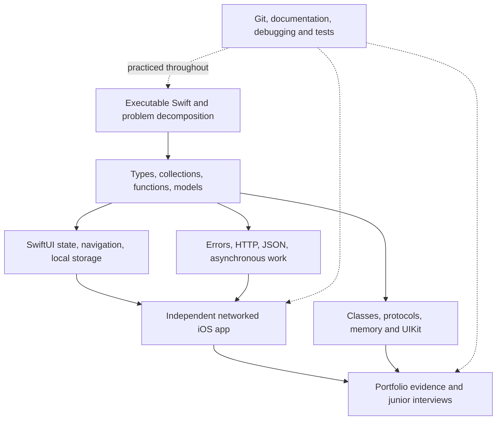

# ROADMAP

Initialized: 2026-09-21. Current position: initial probe complete; begin Phase 1.

Plan around 16 weeks, with a readiness checkpoint at week 12. Use the learner's five-hour daily availability; a provisional rhythm is six study days and one rest/light-review day per week. Adjust pace to demonstrated capability. Week ranges are estimates, not automatic promotions.

## Dependency structure

## Phases and exit evidence

| Phase / estimated weeks | Focus and practical work                                                                                                                                                                                                                                                          | Evidence required to advance                                                                                                                    |
| ----------------------- | --------------------------------------------------------------------------------------------------------------------------------------------------------------------------------------------------------------------------------------------------------------------------------- | ----------------------------------------------------------------------------------------------------------------------------------------------- |
| 1 / 1–2                 | Write and run Swift: let/var, types, operators, branches, loops, functions, arrays/dictionaries/sets, optionals, and small structs. Build a tiny habit/task core without a UI. Start Git, compiler diagnostics, documentation lookups, and debugger inspection.                   | Independently implement a small requirement, run boundary/empty-input checks, explain the code, and fix a bug using observed evidence.          |
| 2 / 3–5                 | Build the first small SwiftUI app: layout, state ownership, bindings, lists, identity, forms, navigation, input validation, and local persistence. Introduce enums/closures when motivated. Start unit tests around meaningful model behavior.                                    | Build an add/edit/delete flow, keep data across launches, diagnose a state bug, and add a new feature without a walkthrough.                    |
| 3 / 6–8                 | Begin the second app around a personally useful API-backed need. Learn HTTP, JSON/Codable, URLSession, error handling, async/await, cancellation, and main-actor UI updates. Separate presentation from data access; introduce protocols/test substitutes through concrete needs. | Explain request-to-screen data flow and demonstrate loading, success, empty, and failure/retry behavior using controlled inputs.                |
| 4 / 9–10                | Learn to maintain existing iOS code: classes, value/reference semantics, ARC and closure captures, UIKit views/controllers, lifecycle, Auto Layout, lists, delegation, and navigation. Compare MVC/MVVM through the apps already built.                                           | Build or modify one UIKit list/detail feature, set breakpoints, inspect values, and explain responsibilities and object ownership.              |
| 5 / 11–13               | Finish the second app with a tightly scoped user need. Add appropriate local saved data, tests, accessibility, performance checks, and feedback-driven refinements. Revisit the first app for independent changes.                                                                | Demonstrate the app end to end, handle a surprise change request, explain design tradeoffs, and reproduce/fix a defect independently.           |
| 6 / 14–16               | Polish portfolio evidence, READMEs, setup instructions, demos, and CV. Practice small coding tasks, project explanations, code review, Git collaboration, and feature/debugging interviews. Learn release/signing/TestFlight workflow when relevant.                              | Complete a mock junior assignment with documentation allowed, present the projects clearly, and explain contributions and limitations honestly. |

Start assessing actual Indonesian junior/intern openings around weeks 8–10 and apply when there is demonstrable work. Continue improving during applications. International remote/relocation roles are additional targets; eligibility and language requirements will be checked per role.

## Project scope

- Project 1: a small local habit/task tracker is the provisional learning vehicle. Another similarly small personal need can replace it. Its core begins in Phase 1 and gains a UI in Phase 2.
- Project 2: one personally useful networked app, chosen before Phase 3 after discussing real needs. Keep its first release to a few complete user flows. The existing Unix-command app is a possible domain, not evidence of independent implementation.
- UIKit work is a bounded maintenance exercise, not a third full portfolio app.
- Two explainable, functioning projects are the target. Portfolio evidence includes meaningful commits, tests where appropriate, a demo, setup instructions, and design decisions. Store publication is optional, not a gate for beginning applications.

## Transferable foundations throughout

- Decompose requirements into inputs, outputs, rules, examples, and edge cases.
- Choose suitable data structures; practice search, filtering, counting, sorting, and basic complexity reasoning with app data.
- Understand state, scope, mutation, types, errors, abstraction, and separation of responsibilities.
- Use Git diffs/commits early, then branches and a small conflict-resolution exercise.
- Practice reproduction, hypotheses, evidence, debugger inspection, and regression checks.
- Read a small relevant documentation section, apply it, then explain the result in the learner's own words.
- Build technical communication through short English project explanations and written decisions.

## Study and assistance rhythm

Use the learning loop: PROBE → PLAN → TEACH → PRACTICE → TEST → UPDATE. Probe new prerequisite branches briefly when they arise.

An example five-hour study window: 15 minutes retrieval, 35 minutes explanation/docs, 100 minutes building, 50 minutes debugging/testing, 40 minutes independent variation, 10 minutes recap, and 50 minutes breaks spread through the window. Adapt this rather than filling time with more quizzes.

The learner writes practice implementations. First attempt → evidence of the problem → progressively stronger hints → explanation or solution when requested/needed. AI can help with tutoring and review. Documentation and ordinary symbol completion are allowed in practice; generated implementations are excluded from independence checks. Rebuild or modify learned work later with the example closed.

## Planning basis and scope control

A sampled [Indocyber junior posting](https://id.linkedin.com/jobs/view/junior-ios-developer-at-indocyber-global-teknologi-pt-4465484866) includes Swift/Xcode, UIKit/SwiftUI, APIs/JSON, Git, layout, debugging, and tests. This supports the chosen core; it is an illustrative posting, not a survey or confirmation the vacancy remains open. See RESOURCES.md for primary learning references.

Defer advanced architecture catalogs, deep Objective-C, reactive-framework specialization, complex backends, and multiple additional languages unless a project or target role creates a concrete need. Reassess at weeks 4, 8, and 12 using independent performance.

Completed: initial diagnostic probe and personalized plan. No programming or app-building milestone has yet been passed.
