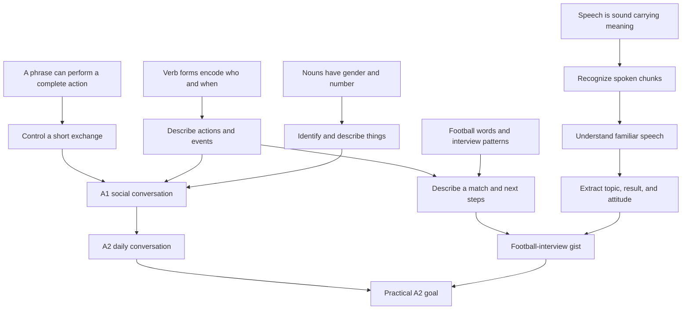

# ROADMAP

## Learning strategy

Build usable conversation and listening together. Each stage introduces a small language system, uses it in a real exchange, and adds a football-interview application. Practice follows this loop:

`predict → attempt/listen → inspect → explain → retry → short check`

## Dependency map

## Stage 1 — Sound and conversational survival

- Five stable vowel sounds, syllables, and essential spelling–sound patterns.
- Greetings, courtesy, yes/no, names, countries, and numbers 0–20.
- Repair phrases: “I don't understand,” “Can you repeat?”, and “More slowly, please.”
- Outcome: survive and repair a 30–60 second introductory exchange.

## Stage 2 — Identity and first conversation

- High-frequency verbs for being, being called, having, living, and speaking.
- Question words: what, how, where, where from, who, and how many.
- Answer-plus-follow-up turn taking.
- Football strand: ask which team or player someone likes.
- Outcome: exchange basic personal information without reading a script.

## Stage 3 — Interests and simple opinions

- Articles, grammatical gender/number, and basic adjective agreement.
- Express likes, preferences, and wants.
- Connect ideas with “and,” “but,” “because,” “also,” and “neither.”
- Football strand: club, player, position, simple praise, and criticism.
- Outcome: hold a short conversation about interests and football.

## Stage 4 — Routine, people, and time

- Present-tense actions, essential irregular verbs, time, days, and frequency.
- Describe daily life, family, friends, work/study, and regular football viewing.
- Outcome: ask and answer follow-up questions about familiar routines.

## Stage 5 — Everyday transactions

- Cafés, food, shopping, prices, transport, locations, and directions.
- Make polite requests and clarify misunderstandings.
- Outcome: complete predictable real-world role-plays.

## Stage 6 — Recent events and match reports

- Express completed events with high-frequency past forms.
- Recognize both common Spain and Latin American ways of discussing recent events.
- Football strand: result, goals, chances, first/second half, and performance.
- Outcome: describe yesterday or a match in a connected sequence.

## Stage 7 — Plans, duties, comparisons, and feelings

- Future plans, obligations, invitations, comparisons, and physical/emotional states.
- Football strand: what the team must improve and the next match.
- Outcome: discuss a recent event, reaction, reason, and next step.

## Stage 8 — A2 integration

- Initiate, maintain, repair, and close predictable conversations.
- Mixed listening with varied speakers and accents.
- DELE A2-style speaking and listening checkpoints.
- Football interview loop: predict context, listen for gist, gather evidence, inspect transcript, shadow, and retest without text.
- Outcome: demonstrate the completion evidence in `GOAL.md`.

## Dialect policy

Use broadly understandable Spanish with `tú`, `usted`, and `ustedes` for production. Train recognition of Spain's `vosotros`, major pronunciation differences, and common football usage from Spain and Latin America.

## Current position

Initial roadmap and audio approach discussed. Ready to begin Stage 1, Lesson 1: Spanish vowel sounds and the first usable greeting exchange.
